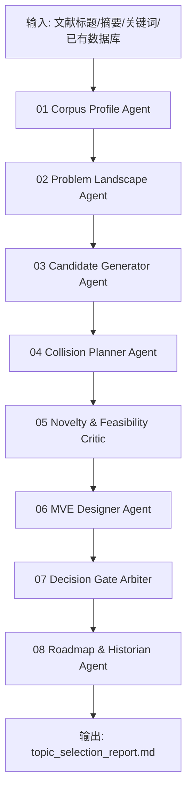

# Research Topic Selection Skill v3

<p align="center">
  <b>面向化工与材料研究的 Science-first 多 Agent 选题筛选 Skill</b><br>
  从文献语料、科学问题、撞车风险、最小验证实验和博士延展性五个维度，系统筛选真正值得做的研究方向。
</p>

<p align="center">
  
  
  
  
  
</p>

---

## 01. 这个 Skill 解决什么问题？

很多材料科研选题看起来“新”，但真正推进时会暴露出几个问题：

- 只是把 AI/机器学习套在已有材料体系上，没有清楚的材料科学问题；
- 只看标题和摘要，忽略了已经被大量研究的直接撞车方向；
- 选题听起来宏大，但没有最小可验证实验，研一/研二阶段难以落地；
- 只有算法亮点，没有样品、表征、性能指标和失败判据；
- 课题无法形成硕士到博士的连续研究故事。

`research-topic-selection-skill-v3` 的目标不是“自动生成灵感”，而是提供一个 **可审计、可复盘、可继续迭代的选题决策工作流**：

> 先判断科学问题是否成立，再判断是否需要 AI；先判断是否能做最小验证，再判断是否值得扩展为长期方向。

---

## 02. 核心定位

**中文定位**

> 面向化工与材料研究的多 Agent 选题筛选 Skill：从文献语料中识别研究空白，生成候选方向，进行撞车风险规划、创新性审查、可行性评估、最小验证实验设计和 GO / CONDITIONAL GO / NO-GO 决策。

**English positioning**

> A Codex-native, JSON-first multi-agent skill for science-first research topic selection in chemical and materials engineering, focusing on corpus-driven opportunity mining, collision-risk planning, feasibility critique, minimum viable experiment design, and decision-gated research roadmapping.

---

## 03. 设计原则

### Science-first，而不是 AI-first

本 Skill 默认采用以下审查顺序：

```text
材料科学问题是否真实存在？
        ↓
该问题是否能通过可控实验或可靠数据验证？
        ↓
AI 是否能降低搜索成本、提高归纳能力或形成闭环？
        ↓
该选题是否具有论文产出和博士延展性？
```

如果一个候选方向只有“机器学习 + SHAP + 设计规则”，但没有明确的材料变量、物理机制、实验判据和失败边界，它会被降级。

### 不夸大创新，不伪造文献

撞车审计只生成检索策略和风险定义，不编造 DOI，不虚构引用。需要外部检索时，输出 precise queries、broad queries、direct collision、partial collision 和 adjacent acceptable 的判据。

### 选题必须能落地

每个候选方向都必须输出：

- 主科学问题；
- 可控变量；
- 最小验证实验；
- 表征与性能指标；
- kill criteria；
- 预期第一篇论文形态；
- 后续博士阶段延展路径。

---

## 04. 多 Agent 架构



### Agent 分工

| Agent | 作用 | 主要输出 |
|---|---|---|
| 01 Corpus Profile Agent | 识别语料范围、主题密度、热点堆积和数据质量 | `01_corpus_profile.json` |
| 02 Problem Landscape Agent | 从材料科学角度构建问题地图 | `02_problem_landscape.json` |
| 03 Candidate Generator Agent | 生成候选选题，避免泛泛而谈 | `03_candidate_topics.json` |
| 04 Collision Planner Agent | 为每个候选方向生成撞车检索计划 | `04_collision_plan.json` |
| 05 Novelty & Feasibility Critic | 评估创新性、可控性、仪器需求、失败风险 | `05_critic_review.json` |
| 06 MVE Designer Agent | 设计最小验证实验和 kill criteria | `06_mve_designs.json` |
| 07 Decision Gate Arbiter | 输出 GO / CONDITIONAL GO / NO-GO 决策 | `07_decision_gate.json` |
| 08 Roadmap & Historian Agent | 生成硕士-博士延展路线与记忆更新 | `08_roadmap_memory.json` |

---

## 05. JSON-first：降低 token 消耗

这个 Skill 不要求每个 Agent 反复阅读全文语料。所有中间态都以 JSON 文件传递：

```text
state/
├── 01_corpus_profile.json
├── 02_problem_landscape.json
├── 03_candidate_topics.json
├── 04_collision_plan.json
├── 05_critic_review.json
├── 06_mve_designs.json
├── 07_decision_gate.json
└── 08_roadmap_memory.json
```

每个 Agent 只读取自己需要的局部 JSON，减少长上下文重复消耗，也方便人工审查和版本控制。

---

## 06. 输入与输出

### 输入

```text
inputs/
├── papers.csv              # 标题、摘要、年份、DOI、关键词等
├── constraints.yaml        # 研究边界、排除方向、设备条件、时间窗口
├── user_context.md         # 当前研究基础与个人目标，可选
└── prior_topics.json       # 已淘汰或已确认的旧选题，可选
```

`papers.csv` 推荐字段：

```text
title, abstract, year, journal, doi, keywords, system, material, performance_metric
```

### 输出

```text
outputs/
├── topic_selection_report.md        # 主报告
├── candidate_scoreboard.csv         # 候选方向评分表
├── collision_queries.csv            # 撞车检索式
├── mve_plan.csv                     # 最小验证实验表
├── decision_summary.json            # GO / CONDITIONAL GO / NO-GO 总结
└── state/*.json                     # Agent 中间态
```

---

## 07. 决策框架

每个候选方向会被打分，但最终不是简单按总分排序，而是进入决策门：

| 决策 | 含义 |
|---|---|
| `GO` | 科学问题明确，撞车风险可控，MVE 可执行，具备论文潜力 |
| `CONDITIONAL GO` | 有潜力，但必须先补检索、补数据或降低命题强度 |
| `NO-GO` | 科学问题弱、撞车严重、实验不可控或过度 AI 套皮 |

默认评分维度：

```text
scientific_problem_strength
novelty_potential
collision_risk_inverse
experimental_feasibility
data_availability
mve_clarity
publication_potential
phd_continuity
ai_necessity
```

---

## 08. 面向材料方向的默认适配

本 Skill 可用于一般化工与材料研究，但默认示例面向：

```text
biomass-derived carbon materials
hard carbon
porous carbon
aqueous supercapacitors
sodium-ion batteries
lithium-ion batteries
AI for materials
literature-derived datasets
Bayesian optimization
structure-property relationship
```

默认会警惕以下低质量方向：

- 只做“数据库 + XGBoost + SHAP”的开环套路；
- 无实验闭环支撑的“自动发现材料”；
- 缺少材料机制的纯算法包装；
- 已经高度拥挤但没有新变量、新指标或新验证协议的方向；
- 设备条件、样品数量、周期和导师资源明显不匹配的方向。

---

## 09. 快速开始

### 安装

```bash
pip install -r requirements.txt
pip install -e .
```

### 运行 demo

```bash
python examples/run_demo.py
```

### 命令行运行

```bash
python -m research_topic_selection_skill.cli run \
  --corpus examples/input/demo_papers.csv \
  --constraints examples/input/constraints.yaml \
  --out outputs/demo_topic_selection
```

---

## 10. 示例输出摘要

运行 demo 后会看到类似结果：

```text
Decision summary
- GO: 1
- CONDITIONAL GO: 2
- NO-GO: 1

Top candidate:
Composition-normalized biomass hard-carbon precursor screening

Why:
- clear science problem
- feasible MVE
- moderate collision risk
- strong master-to-PhD continuity
```

---

## 11. 仓库结构

```text
research-topic-selection-skill-v3/
├── README.md
├── README_en.md
├── skill.md
├── AGENTS.md
├── pyproject.toml
├── requirements.txt
├── config/
│   ├── scoring_rules.yaml
│   ├── topic_scope.yaml
│   └── collision_rules.yaml
├── prompts/
│   ├── 01_corpus_profile_agent.md
│   ├── 02_problem_landscape_agent.md
│   ├── 03_candidate_generator_agent.md
│   ├── 04_collision_planner_agent.md
│   ├── 05_novelty_feasibility_critic.md
│   ├── 06_mve_designer_agent.md
│   ├── 07_decision_gate_arbiter.md
│   └── 08_roadmap_historian_agent.md
├── schemas/
│   ├── corpus_profile.schema.json
│   ├── candidate_topics.schema.json
│   ├── collision_plan.schema.json
│   ├── critic_review.schema.json
│   ├── mve_design.schema.json
│   └── decision_summary.schema.json
├── src/research_topic_selection_skill/
│   ├── cli.py
│   ├── corpus.py
│   ├── candidates.py
│   ├── collision.py
│   ├── scoring.py
│   ├── mve.py
│   ├── report.py
│   └── utils.py
├── examples/
├── tests/
└── docs/
```

---

## 12. 与其他 Skill 的关系

这个 Skill 更适合作为研究工作流的第一步：

```text
research-topic-selection-skill-v3
        ↓
ai-extracted-data-cleaner
        ↓
carbon-literature-bo-replay-skill
        ↓
materials-review-audit-skill
```

对应关系：

| Skill | 作用 |
|---|---|
| `research-topic-selection-skill-v3` | 选题筛选、撞车规划、MVE 设计 |
| `ai-extracted-data-cleaner` | 清洗 AI/OCR 提取的文献数据 |
| `carbon-literature-bo-replay-skill` | 在文献数据库上做离线 BO 回放 |
| `materials-review-audit-skill` | 综述投稿前一致性审计 |

---

## 13. 使用边界

这个 Skill 不会替代导师判断，也不会自动证明选题创新。它的职责是：

- 把隐含假设显性化；
- 把候选方向转化为可检索、可验证、可否决的结构化对象；
- 让选题决策从“感觉有意思”变成“证据、风险和实验闭环可审计”。

建议最终输出仍需结合：

- 真实全文检索；
- 设备与经费条件；
- 导师组方向；
- 样品制备能力；
- 目标期刊要求。

---

## 14. License

MIT License.

